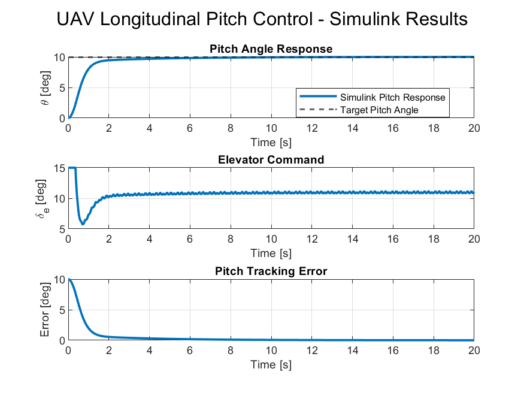

# 🚀 UAV Longitudinal Pitch Control Project

<p align="center">
  <b>MATLAB & Simulink Based UAV Pitch Control System</b>
</p>

<p align="center">
  Aerospace Engineering • Flight Dynamics • PID Control • MATLAB • Simulink
</p>

---

## 📌 Project Overview

This project presents a simplified **UAV longitudinal pitch control system** developed using **MATLAB and Simulink**.

The main objective of this project is to model the pitch dynamics of a UAV, design a PID controller, analyze closed-loop performance, and validate the final control system using a Simulink block diagram model.

This study was developed as part of my **Aerospace Summer 2026 Engineering Portfolio** to improve my skills in flight dynamics, control systems, MATLAB/Simulink workflows, and engineering documentation.

---

## 🎯 Project Goals

The main goals of this project are:

- Model simplified UAV longitudinal pitch dynamics
- Analyze the open-loop pitch response
- Design a PID controller for pitch angle tracking
- Tune PID gains and compare controller performance
- Test different pitch reference commands
- Analyze actuator saturation effects
- Implement the final controller in Simulink
- Evaluate closed-loop performance using engineering metrics
- Document the project in a clean and professional format

---

## 🛩️ System Description

The system represents the longitudinal pitch motion of a simplified UAV.

The elevator deflection is used as the control input, and the pitch angle is the system output.

```text
Elevator Input → UAV Pitch Dynamics → Pitch Angle Response
```

The simplified pitch dynamics are represented using a second-order system.

```text
theta_ddot + 2*zeta*omega_n*theta_dot + omega_n^2*theta = K_theta*delta_e
```

Where:

| Symbol | Description |
|---|---|
| `theta` | Pitch angle |
| `theta_dot` | Pitch rate |
| `delta_e` | Elevator deflection |
| `omega_n` | Natural frequency |
| `zeta` | Damping ratio |
| `K_theta` | Elevator-to-pitch gain |

---

## 📐 Transfer Function Model

The pitch dynamics are represented using the following transfer function:

```text
G(s) = K_theta / (s^2 + 2*zeta*omega_n*s + omega_n^2)
```

For this project, the numerical transfer function is:

```text
G(s) = 3 / (s^2 + 1.62s + 3.24)
```

This transfer function represents the simplified relationship between the elevator deflection input and the UAV pitch angle output.

---

## 🔁 Control System Architecture

The closed-loop pitch control system follows the structure below:

```text
Pitch Command → Tracking Error → PID Controller → Elevator Saturation → UAV Pitch Dynamics → Pitch Response
```

The pitch command is compared with the actual pitch response. The tracking error is processed by the PID controller, which generates the required elevator command. The elevator command is then limited by a saturation block to represent the physical actuator limit.

---

## ⚙️ Final PID Controller

After the PID tuning study, the final controller gains were selected as:

| Gain | Value |
|---|---:|
| `Kp` | 4.0 |
| `Ki` | 1.2 |
| `Kd` | 1.8 |

These gains were selected because they provided a stable closed-loop response with zero overshoot, zero steady-state error, and improved settling time.

---

## 🧪 MATLAB Studies

The MATLAB part of the project includes several analysis stages:

| Study | Description |
|---|---|
| Open-loop response | Analysis of UAV pitch dynamics without a controller |
| PID control | Closed-loop pitch tracking using a PID controller |
| PID tuning | Comparison of different PID gain sets |
| Final controller analysis | Detailed performance analysis of the selected controller |
| Command tracking | Testing 5°, 10°, and 15° pitch commands |
| Actuator limit study | Evaluation of elevator saturation and control authority |

---

## 🧩 Simulink Implementation

The final PID controller was implemented in Simulink using a closed-loop block diagram model.

The Simulink model includes:

- Step input for pitch command
- Sum block for tracking error
- PID Controller block
- Saturation block for elevator limit
- Transfer Function block for UAV pitch dynamics
- Scope block for visualization
- To Workspace blocks for MATLAB result analysis

The Simulink closed-loop structure is:

```text
theta_ref → error → PID Controller → Elevator Saturation → UAV Pitch Dynamics → theta
     ↑                                                                  |
     |__________________________________________________________________|
```

---

## 📊 Final Simulink Results

For a **10-degree pitch command**, the final Simulink model produced the following results:

| Metric | Result |
|---|---:|
| Target pitch angle | 10.00 deg |
| Final pitch angle | 10.00 deg |
| Maximum pitch angle | 10.00 deg |
| Maximum elevator input | 15.00 deg |
| Steady-state error | 0.00 deg |
| Overshoot | 0.00 % |
| Settling time | 5.61 s |

---

## 📈 Simulink Response Plot



---

## 🔍 Key Engineering Findings

The final PID controller successfully tracks the 10-degree pitch command with:

- Zero overshoot
- Zero steady-state error
- Stable closed-loop response
- Settling time of approximately **5.61 seconds**

The command tracking analysis showed that the controller can successfully track **5-degree** and **10-degree** pitch commands with a **15-degree elevator limit**.

However, for a **15-degree pitch command**, the system could not fully settle within the required tolerance band due to actuator saturation.

The actuator limit study showed that approximately **20 degrees of elevator authority** is required to successfully track a 15-degree pitch command.

---

## 🧠 Engineering Interpretation

The results show that the selected PID controller provides stable and accurate pitch tracking performance for moderate pitch commands.

The actuator saturation analysis highlights an important engineering limitation. Even if a controller is properly tuned, the physical limits of the control surface can restrict the achievable pitch response.

This makes the project more realistic because real UAV flight control systems must always consider actuator limits, control authority, and closed-loop stability.

---

## 📁 Repository Structure

```text
03-UAV-Pitch-Control-Project
│
├── MATLAB
│   ├── uav_pitch_open_loop.m
│   ├── uav_pitch_pid_control.m
│   ├── uav_pitch_pid_tuning.m
│   ├── uav_pitch_final_controller.m
│   ├── uav_pitch_command_tracking.m
│   ├── uav_pitch_actuator_limit_study.m
│   ├── uav_pitch_simulink_params.m
│   └── run_uav_pitch_simulink_analysis.m
│
├── Simulink
│   └── uav_pitch_pid_control.slx
│
├── 03_Results
│   ├── uav_pitch_simulink_results.png
│   ├── uav_pitch_simulink_performance.csv
│   ├── uav_pitch_command_tracking.png
│   ├── uav_pitch_command_tracking_results.csv
│   ├── uav_pitch_final_controller_response.png
│   └── uav_pitch_pid_tuning_comparison.png
│
└── README.md
```

---

## 🛠️ Tools Used

- MATLAB
- Simulink
- PID Control
- Transfer Function Modeling
- Closed-Loop Control Analysis
- Numerical Simulation
- Aerospace Flight Dynamics
- Engineering Documentation

---

## ✅ Skills Demonstrated

- UAV longitudinal dynamics modeling
- PID controller design and tuning
- MATLAB scripting
- Simulink block diagram modeling
- Closed-loop system analysis
- Actuator saturation analysis
- Engineering result interpretation
- Technical project documentation

---

## 🏷️ Project Category

**Aerospace Engineering**  
**UAV Flight Dynamics**  
**Longitudinal Control**  
**MATLAB / Simulink Simulation**  
**PID Controller Design**

---

## 👨‍💻 Author

**Emirhan Tevfik Yiğit**  
Aerospace Engineering Student  

MATLAB & Simulink | UAV Design | Aerodynamics | Engineering Analysis